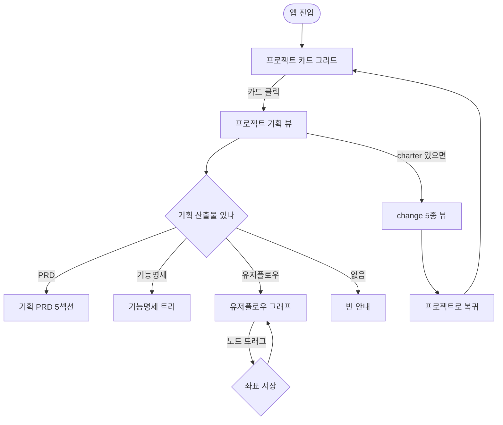

# 유저 플로우: flowforge 기획 대시보드 메인 흐름

> openspec-plan 3단계 도그푸딩 — flowforge가 자기 자신의 화면 흐름을 Mermaid flowchart로 기술한다.
> 노드 모양: 시작 stadium / 페이지 box / 행동·분기 diamond. flowforge가 파싱해 그래프로 렌더한다.

```mermaid
flowchart TD
  Start(["앱 진입"]) --> Grid["프로젝트 카드 그리드"]
  Grid -->|카드 클릭| Skeleton["프로젝트 기획 뷰"]
  Skeleton --> HasDocs{"기획 산출물 있나"}
  HasDocs -->|PRD| Prd["기획 PRD 5섹션"]
  HasDocs -->|기능명세| Features["기능명세 트리"]
  HasDocs -->|유저플로우| Flow["유저플로우 그래프"]
  HasDocs -->|없음| Empty["빈 안내"]
  Flow -->|노드 드래그| Save{"좌표 저장"}
  Save --> Flow
  Skeleton -->|charter 있으면| Views["change 5종 뷰"]
  Views --> Back["프로젝트로 복귀"]
  Back --> Grid
```
