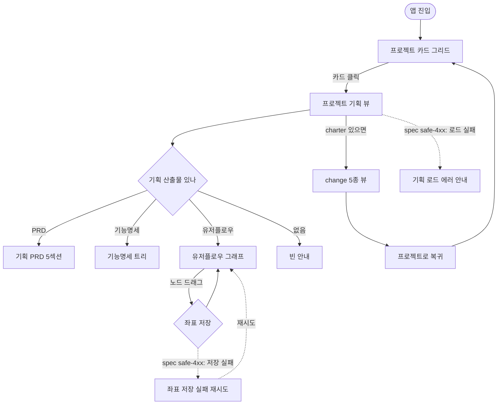

# 유저 플로우: flowforge 기획 대시보드 메인 흐름 (v2 — 에지케이스 자동 분기)

> v1의 happy path 메인 흐름을 보존한 채, 결정3(userflow-edgecase-branches)을 반영한 버전.
> happy path = 실선(`-->`), spec 근거로 자동 생성된 에지케이스 경로 = 점선(`-.->`)으로 시각 구분한다.
> 노드 모양: 시작 stadium / 페이지 box / 행동·분기 diamond. flowforge가 파싱해 그래프로 렌더한다.

